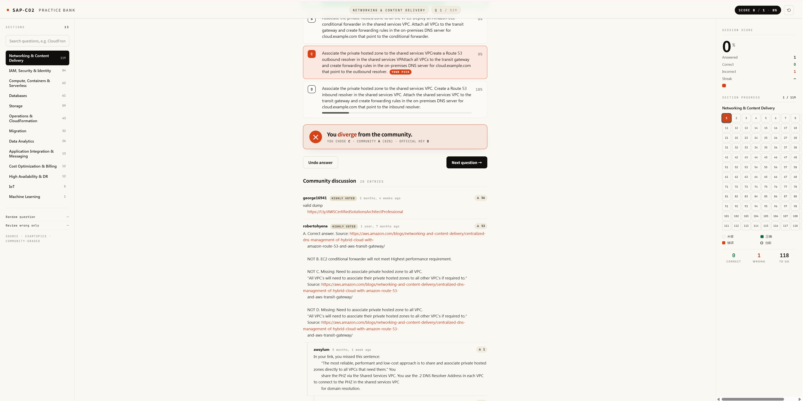

# SAP-C02 Quiz

**Live demo:** https://xiamiyoung.github.io/sap-c02-quiz/

A single-file, offline-friendly quiz app for the **AWS Certified Solutions Architect – Professional (SAP-C02)** exam. Questions are **organized by topic category** (not dumped as one long random list) so you can drill the areas you're weakest in. Just open `index.html` in any modern browser — no build step, no server, no dependencies.

## Highlights

- **Categorized by topic** — practice one domain at a time instead of grinding through a shuffled mega-pool
- Pure single-file HTML — works offline, works anywhere a browser runs
- Zero dependencies, zero build

## Usage

- Clone the repo, or download `index.html` directly
- Double-click `index.html` (or drag it into your browser)
- That's it.

## License

MIT — see [LICENSE](./LICENSE).
